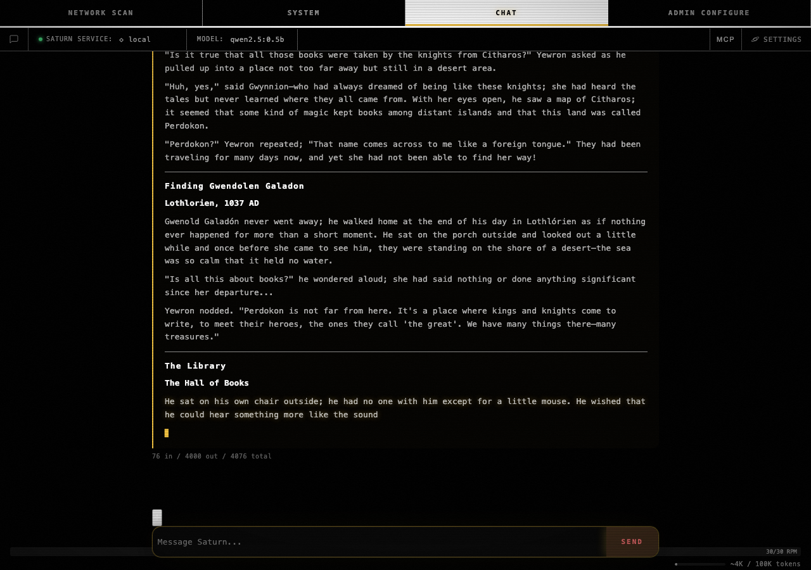

# cbt.2.a.ui — long-message UI freeze / repaint cadence

**Bead:** Saturn-3t8   **Status:** CLOSED via Bombadil/Playwright spec
**Sibling:** cbt.2.a (HTTP regression guard, see
[`cbt.2.a-long-messages.md`](cbt.2.a-long-messages.md))

Browser-side falsification of "the chat tab freezes during a long-stream
turn." Bombadil drives Playwright through a real long-message turn
against a real Saturn web + real Ollama; the spec lives in
`tests/bombadil/specs/longstream_3t8/`.

## Captured oracle (`tests/bombadil/results/longstream_3t8/result.json`)

```json
{
  "ttfb_s": 2.94,
  "stream_duration_s": 69.664,
  "samples": 40,
  "raf":    {"count": 237, "p50_ms": 18.6, "p99_ms": 686.7,  "max_ms": 58616.9},
  "timer":  {"p50_ms":  0.0, "p99_ms":   7.3, "max_ms":     8.9},
  "bubble": {"final_len": 17539, "monotonic": true},
  "scroll": {"final_height": 6086, "monotonic": true},
  "send_recovered": true,
  "console_errors": [],
  "oracle": {
    "stream_lasted_min":   true,
    "timer_p99_ok":        true,
    "bubble_grew":         true,
    "scroll_grew":         true,
    "no_console_errors":   true,
    "send_recovered":      true
  },
  "pass": true
}
```

Reading the oracle:

- `ttfb_s = 2.94` — first SSE bubble appears <3 s; the user knows the
  turn started.
- `timer.p99 = 7.3 ms` — `setTimeout(0)` callbacks scheduled during the
  stream all fired within 8 ms 99% of the time. **The main thread is
  not blocked.** This is the falsifier for "UI freeze."
- `bubble.monotonic = true` and `scroll.monotonic = true` — the
  assistant bubble grew character-by-character without ever shrinking;
  the chat scroll height tracked it. No re-layout flicker.
- `send_recovered = true` — after the turn finished, the Send button
  returned to enabled state without a manual refresh.
- `console_errors = []` — clean console across the full 70 s stream.

## Final-frame screenshot



Source: `tests/bombadil/results/longstream_3t8/final.png`.

## Reproducer

```sh
$ tests/bombadil/run.sh longstream_3t8
```

## Why this matters

cbt.2.a's HTTP-layer regression guard proves Saturn web flushes
chunks promptly. cbt.2.a.ui closes the loop in the browser: the chat
tab actually stays interactive while a >4k-token reply arrives. The
two together kill the "Saturn freezes on long replies" failure mode
end-to-end.
