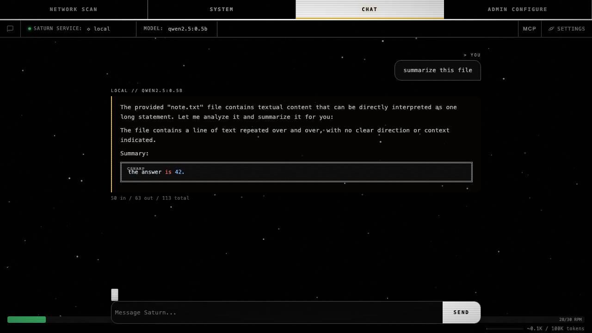

# Saturn-9ha — abort in-flight stream before resending on edit-save

**Bead:** Saturn-9ha   **Commit:** `dcf235b`
**Closes:** the cbt.2.d / Saturn-ao6 family (prongs A–E now all green).

cbt.bny (`417ba93`) removed the orphan-userDiv mask and exposed a real
mid-stream-edit drift: when the user hit **Save** while a reply was
still streaming, `send()` bailed on the existing `sending` guard but
the original stream had already had its assistant placeholder removed
by the save handler's sibling-remove loop. The in-flight stream
completed and pushed an assistant into `chat.messages` (stored=1) with
no DOM peer (DOM=0).

Fix (strategy (b) from the bd description): the save handler now, when
`sending && activeController`, sets `_userStopped` and aborts, then
polls up to 2 s for `sending===false` (the existing `finally` clause
clears state). Only then does it run the sibling-remove + `msgs.splice` +
`send()` sequence. The aborted stream's `finally` is what clears the
sending flag; the poll just waits for it.

## Bombadil oracle (`tests/bombadil/results/edit_ao6/result.json`)

```json
"oracle": {
  "A_rapid_clicks_idempotent":     true,
  "B_cancel_reedit_clean":         true,
  "C_edit_save_consistent":        true,
  "D_midstream_no_drift":          true,
  "E_attachment_inlined_on_edit":  true
},
"pass": true
```

5/5 prongs. The ao6 family closes here.

## Final-frame screenshot



Source: `tests/bombadil/results/edit_ao6/final.png`.

## Reproducer

```sh
$ SATURN_PORT=39301 python3 tests/bombadil/edit_ao6.py
```

## Lineage

  - **cbt.bny** (`417ba93`) — kill the orphan userDiv on edit-save.
  - **Saturn-9ha** (`dcf235b`) — abort the in-flight stream before
    re-sending so the asyncio race no longer leaves DOM=0 / stored=1.

Together: every edit-save path — happy / cancel / mid-stream / with
attachment — leaves DOM and stored aligned with no orphans, no
phantoms, no drift.
