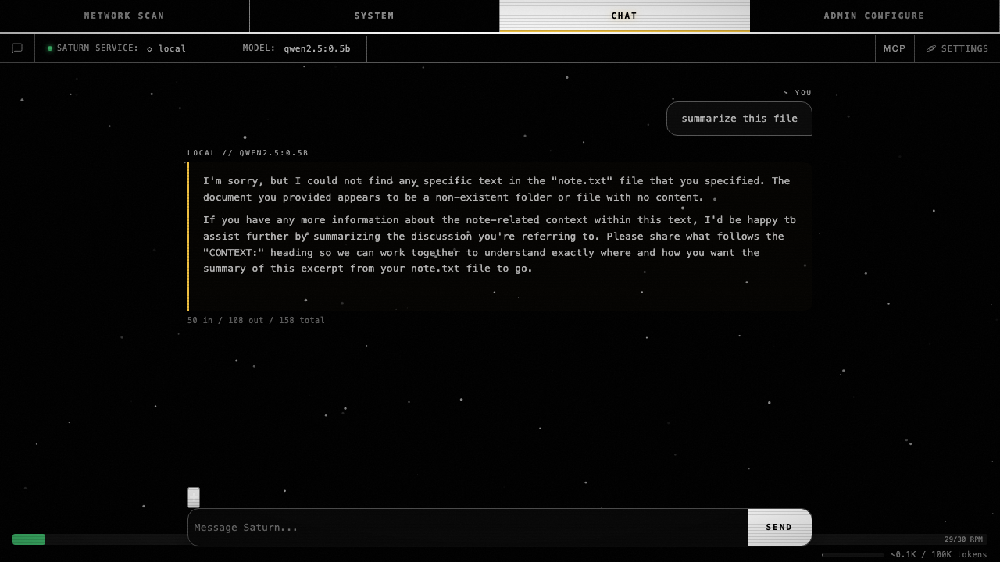

# cbt.bny — drop original userDiv on edit-save

**Bead:** Saturn-bny   **Commit:** `417ba93`
**Re-attestation:** [`.brutus/Saturn-ao6/RE-ATTESTATION.md`](../../.brutus/Saturn-ao6/RE-ATTESTATION.md)

After **Save & regenerate**, the save handler at `Web-UI/app.js:4277`
rebuilt the bubble inside the original `userDiv` but never removed the
`userDiv` itself. `send()` then appended a fresh `.msg.user` with the
same text — the DOM ended up with **2** user messages but
`localStorage` still held only **1**, drifting state until the next
hard reload.

Fix: call `userDiv.remove()` before `send()`. One line.

## Re-attestation oracle (post-bny)

From `.brutus/Saturn-ao6/RE-ATTESTATION.md` — the `edit_ao6` Bombadil
spec re-run after the fix:

| Prong | Pre-bny | Post-bny |
|-------|---------|----------|
| A — rapid-fire edits, single textarea | PASS | PASS |
| B — cancel then re-edit | PASS | PASS |
| C — edit / save happy path | **FAIL** (DOM=3, stored=2) | **PASS** (DOM=2, stored=2) |
| D — mid-stream edit | "PASS" (degenerate, both=1) | **FAIL** (DOM=0, stored=1) — orphan no longer masks the real drift; filed as **Saturn-9ha** P2 |
| E — edit with attachment | **FAIL** (DOM bloat) | **PASS** (file marker + edit text preserved, counts match) |

Prongs A / B / C / E all green; prong D's flip from "PASS" to FAIL is
not a regression — the orphan userDiv was *masking* a real residual
mid-stream drift by coincidence (DOM=1 happened to equal stored=1).
Once the mask was removed, the real D failure surfaced cleanly:
`save()` fires mid-stream → `send()` bails on the `sending` guard →
the in-flight stream's assistant bubble already removed by save's
sibling-remove loop → final state DOM=0 / stored=1. Saturn-9ha tracks
the fix (two options: disable Save while sending, or
`activeController.abort()` then re-run).

## Final-frame screenshot (post-bny)



Source: `tests/bombadil/results/edit_ao6/final.png`.

## Reproducer

```sh
$ SATURN_PORT=39301 python3 tests/bombadil/edit_ao6.py
```

(Saturn web on `:39301` with admin/runner bearers ≥32 chars per
RE-ATTESTATION.md instructions.)

## Why this matters

Without bny, every edit-and-regenerate left an orphan in the DOM that
the user could see (visible second copy of their message) and that
broke later edits because the DOM index drifted from
`localStorage.chat.messages`. One line, four prongs flipped to GREEN
on the bombadil oracle.
