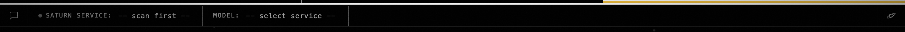

# qj5.1 — top-right response-style pill removed from Chat tab

*2026-05-04T20:17:46Z by Showboat 0.6.1*
<!-- showboat-id: 93fd3372-e3f6-44be-b2dc-4c190daa28c8 -->

Shipped at commit 6461641. The `Default / Concise / Detailed / Code` selector is gone from the chat top bar; the response-style control will move to the per-chat Settings popup (qj5.2).

## Before — `.chat-topbar .strip-right` at parent commit eb62844

```bash {image}
demo/recordings/qj5.1-top-strip-before.png
```


## After — same region at HEAD on autonomous/promo-push

```bash {image}
demo/recordings/qj5.1-top-strip-after.png
```



Only the Settings (planet) icon remains on the right; the Default ▾ pill is removed. Captured against a real Saturn server (port 0, default-runner config) via `tests.harness.web.serve()` + Playwright; cropping is the bounding box of `.chat-topbar` widened to 1440 viewport.

## Reproducer

    bash tests/harness/run.sh    # smoke (must be green)

    LABEL=after  PYTHONPATH=. python3 demo/recordings/_capture_qj5_1.py

    git show eb62844:Web-UI/index.html > Web-UI/index.html  # before state

    LABEL=before PYTHONPATH=. python3 demo/recordings/_capture_qj5_1.py

    git checkout -- Web-UI/index.html                     # restore

## Implementation

Six lines deleted from `Web-UI/index.html` at the `.strip-right` block — the `<select id="style-select">` and its four options. No JS changes; the dependent reads in `Web-UI/app.js` already tolerate a missing element. The relocation lands in qj5.2 (Settings popup).
