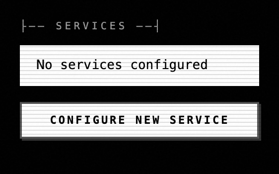

# qj5.13 — Configure page: server-wide settings split

*2026-05-04T21:36:38Z by Showboat 0.6.1*
<!-- showboat-id: cee961dc-5694-4c89-ac2d-27a4f8b606f3 -->

**Status: scaffold prefetched, awaiting UI commit 2.** The server-side schema lift (AdminConfig with ~22 fields + validators + apply hook) is already in saturn/web.py; what's outstanding is the Configure-page UI render under Network Scan → Admin. This document fills in the moment that UI lands; until then, treat the screenshots below as snapshots of the pre-render state.

## Scope

Server-wide settings (max_tokens / temperature / model defaults / rate limits / API-key envs / MCP allow-list / trust policy) belong on the Configure page. Per-chat settings (response style, model override, current service) stay in the chat-strip Settings popup that landed in qj5.2.

## Server-side round-trip — proven now (no UI needed)

POST a server-wide field on a fresh `saturn web` (isolated SATURN_DATA_DIR + SATURN_DEV_MODE=1 + admin bearer), GET it back. The receipt: round-trip preserves the value end-to-end through AdminConfig validators.

```bash
bash demo/recordings/qj5.13_roundtrip.sh
```

```output
── GET (before) ──
{}
── POST {rate_rpm: 99} ──
HTTP 200
── GET (after) ──
{"rate_rpm":99}
```

## UI before — `#admin-section` at HEAD (pre-render: legacy "Configure New Service" only)

```bash {image}
demo/recordings/qj5.13-before-admin.png
```



Once UI commit 2 lands, the scaffold expects a Configure-page subsection under `#admin-section` (or a new sibling) holding inputs for the AdminConfig fields listed in saturn/web.py:1331-1356. Re-run the capture script with LABEL=after to produce qj5.13-after-* PNGs.

## UI after — TODO when UI commit 2 lands

Reproducer (run on the new HEAD after the UI commit ships):

    bash tests/harness/run.sh

    LABEL=after PYTHONPATH=. python3 demo/recordings/_capture_qj5_13.py

Expected outputs:

  - demo/recordings/qj5.13-after-scan-tab.png      Network Scan tab framing

  - demo/recordings/qj5.13-after-admin.png         admin section (post-unlock)

  - demo/recordings/qj5.13-after-configure.png     close-up of the Configure form

  - demo/recordings/qj5.13-after-fullpage.png      full-page screenshot

Then:

    uvx showboat image demo/recordings/qj5.13-configure-page.md demo/recordings/qj5.13-after-admin.png

    uvx showboat image demo/recordings/qj5.13-configure-page.md demo/recordings/qj5.13-after-configure.png

## Implementation pointers

- Schema: `saturn/web.py:1331` (AdminConfig BaseModel, model_config=ConfigDict(extra="forbid")).

- Validators: `saturn/web.py:1361` (validate_admin_config; trust_mode=open, CIDR, IP literal, rate ≥ 1, UUID, period enums).

- Live propagation: `saturn/web.py:1430` (apply_admin_config: updates RATE_RPM/TPM/CONCURRENT and reclassifies discovered services without restart).

- Auth: every /api/admin/config* call requires `SATURN_ADMIN_TOKEN` (qj5.16.2; see qj5.16.2-admin-auth.md).
