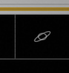
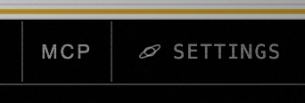
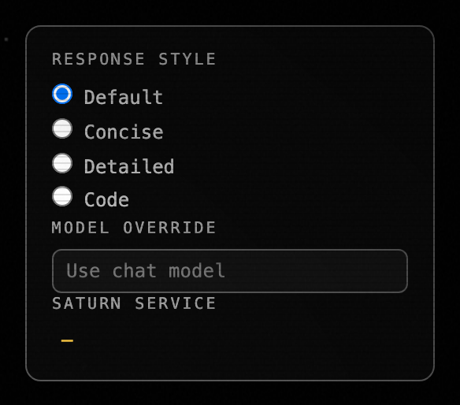

# qj5.2 — Saturn SVG → Settings button + per-chat popup

*2026-05-04T21:18:08Z by Showboat 0.6.1*
<!-- showboat-id: bf811cea-d40d-4e44-b124-eee701534d6e -->

Shipped at commit c2845b4. The chat-strip's right side now carries a labelled "Settings" button (replacing the bare planet SVG) that opens a per-chat popup with response-style radios, model override, and the current Saturn service. The response-style pill removed in qj5.1 (commit 6461641) lands here.

## Before — `.strip-right` at parent 427bb12 (planet SVG only)

```bash {image}
demo/recordings/qj5.2-before-strip.png
```



## After — `.strip-right` at HEAD (Settings label + planet SVG)

```bash {image}
demo/recordings/qj5.2-after-strip.png
```



## After — `#chat-settings-popup` open

```bash {image}
demo/recordings/qj5.2-after-popup.png
```



Captured against a real Saturn server (`tests.harness.web.serve()`, fresh `SATURN_ADMIN_TOKEN`) via Playwright; popup opened by clicking `.strip-right .chat-settings-btn` (force=true to bypass viewport-clip checks). Implementation: `Web-UI/index.html:296-318` adds the popup markup; `Web-UI/app.js:3276` toggles `.hidden` and refreshes the `#chat-current-service` value.

## Reproducer

    bash tests/harness/run.sh

    LABEL=after  PYTHONPATH=. python3 demo/recordings/_capture_qj5_2.py

    git show 427bb12:Web-UI/index.html > Web-UI/index.html

    git show 427bb12:Web-UI/app.js     > Web-UI/app.js

    LABEL=before PYTHONPATH=. python3 demo/recordings/_capture_qj5_2.py

    git checkout -- Web-UI/index.html Web-UI/app.js
