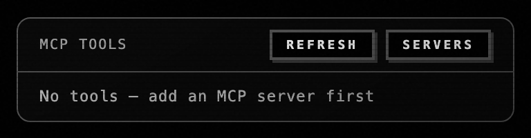
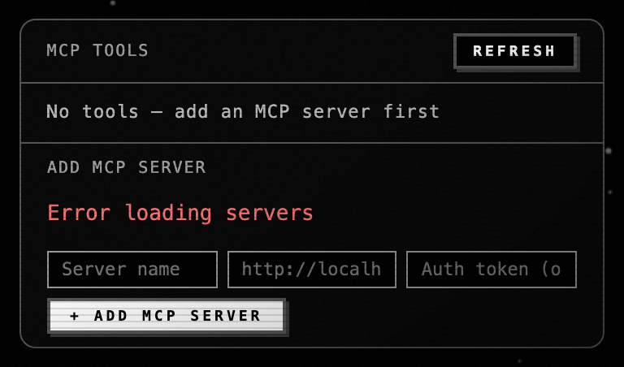
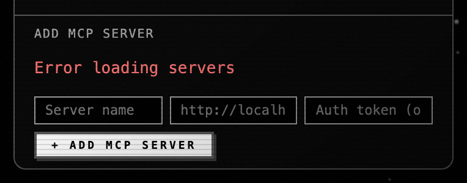

# qj5.3 — MCP popup with visible label + direct Add-MCP-server flow

*2026-05-04T21:18:25Z by Showboat 0.6.1*
<!-- showboat-id: df2038a2-65a0-40a3-a8de-ae478fa96ae4 -->

Shipped at commit 60a589b. The chat-strip's tools-toggle gains an explicit "MCP" label (replacing the unlabelled wrench), and the panel that opens now has a "+ Add MCP server" sub-section that's visible by default — no more digging into the hidden "Servers" sub-button to register a new MCP endpoint.

## Before — `#tools-panel` at parent c2845b4 (no Add-MCP form, hidden "Servers" button)

```bash {image}
demo/recordings/qj5.3-before-panel.png
```



## After — `#tools-panel` at HEAD ("Add MCP server" form visible)

```bash {image}
demo/recordings/qj5.3-after-panel.png
```



## After — `#mcp-servers-config` close-up

```bash {image}
demo/recordings/qj5.3-after-mcp.png
```



Captured against a real Saturn server via the harness + Playwright. The tools panel was opened by clicking `#tools-toggle`. Implementation: `Web-UI/index.html:327-340` removes the gating "Servers" button and unhides `#mcp-servers-config`; `Web-UI/app.js` keeps the existing add/list logic but stops toggling visibility.

## Reproducer

    bash tests/harness/run.sh

    LABEL=after  PYTHONPATH=. python3 demo/recordings/_capture_qj5_3.py

    git show c2845b4:Web-UI/index.html > Web-UI/index.html

    git show c2845b4:Web-UI/app.js     > Web-UI/app.js

    LABEL=before PYTHONPATH=. python3 demo/recordings/_capture_qj5_3.py

    git checkout -- Web-UI/index.html Web-UI/app.js
