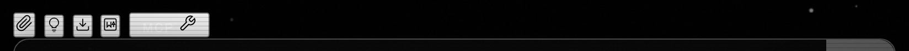
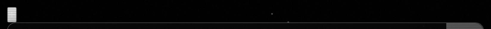
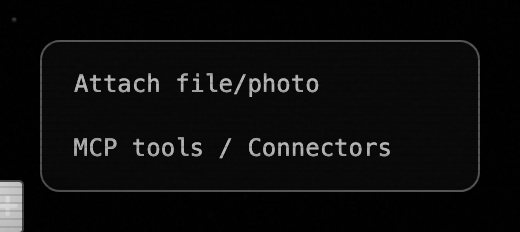

# qj5.4 — collapse 5 chat-input fabs into a single + menu

*2026-05-04T21:18:43Z by Showboat 0.6.1*
<!-- showboat-id: 4b35a2a9-aa25-412d-9158-1ff44ee13ebd -->

Shipped at commit ba2f925. The five unlabelled icons that lived above the chat input (paperclip, thinking, export-JSON, export-MD, MCP-wrench) are gone, replaced by a single "+" button that opens a labelled menu with two items per the brief — Attach file/photo and MCP tools / Connectors. The MCP toggle relocates to the chat-strip (covered in qj5.3); the legacy export/thinking fabs are dropped from the chat surface.

## Before — `.chat-input-fabs` at parent 60a589b (5 icons)

```bash {image}
demo/recordings/qj5.4-before-fabs.png
```



## After — `.chat-input-fabs` at HEAD (single + button)

```bash {image}
demo/recordings/qj5.4-after-fabs.png
```



## After — `#plus-menu` open (Attach + MCP)

```bash {image}
demo/recordings/qj5.4-after-menu.png
```



Captured against a real Saturn server via the harness + Playwright. Menu opened by clicking `#plus-menu-btn`. Implementation: `Web-UI/index.html:378-389` collapses the five `<button class="fab">` entries into `#plus-menu-btn` + `#plus-menu`; `Web-UI/app.js` wires `#plus-attach` to the existing file-upload flow and `#plus-mcp` to `#tools-toggle`.

## Reproducer

    bash tests/harness/run.sh

    LABEL=after  PYTHONPATH=. python3 demo/recordings/_capture_qj5_4.py

    git show 60a589b:Web-UI/index.html > Web-UI/index.html

    git show 60a589b:Web-UI/app.js     > Web-UI/app.js

    LABEL=before PYTHONPATH=. python3 demo/recordings/_capture_qj5_4.py

    git checkout -- Web-UI/index.html Web-UI/app.js
