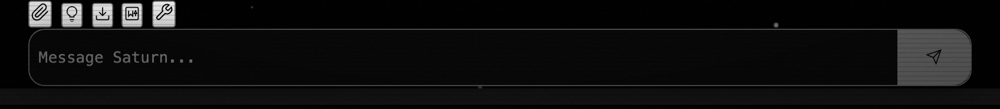

# qj5.5 — Send button vertical alignment

*2026-05-04T19:28:22Z by Showboat 0.6.1*
<!-- showboat-id: 85f33fca-7f32-4be3-8221-d760f96fcd5b -->

Retroactive capture — the alignment fix shipped before fbb5896 (its diff was swept into a writer commit) so this bead lacked an artifact. Captured against autonomous/promo-push HEAD on 2026-05-04.

## Reproduce

    bash tests/harness/run.sh        # smoke (must be green)

    PYTHONPATH=. python3 demo/recordings/_capture_qj5_5.py

## Result — input + send glyph share a single flex baseline

```bash {image}
demo/recordings/qj5.5-send-region.png
```



Implementation: `Web-UI/styles.css` lines 1380–1390 — `.send-glow` uses `display: flex; align-items: center; justify-content: center; align-self: stretch;`. The send glyph is centered against the input row regardless of input height growth (textarea `field-sizing: content` up to `max-height: 150px`).
