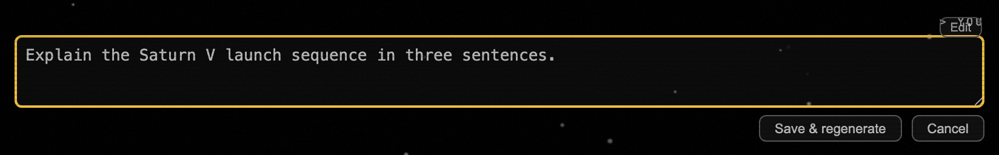

# qj5.6 — edit-sent-message: truncate-and-regenerate

*2026-05-04T21:19:00Z by Showboat 0.6.1*
<!-- showboat-id: b3258556-65ba-437f-b31f-86133158d9fc -->

Shipped at commit a232b13. User messages now carry an Edit affordance (Claude / ChatGPT pattern). Clicking Edit replaces the bubble with a textarea + Save / Cancel; saving truncates the conversation at that turn and re-runs the model from the edited prompt.

## Before — `.msg.user` at parent 38962eb (no Edit button)

```bash {image}
demo/recordings/qj5.6-before-user-msg.png
```


## After — `.msg.user` at HEAD (Edit affordance attached)

```bash {image}
demo/recordings/qj5.6-after-user-msg.png
```


## After — Edit click → `textarea.edit-textarea` + Save & regenerate / Cancel

```bash {image}
demo/recordings/qj5.6-after-editing.png
```



Captured against a real Saturn server via the harness + Playwright. The reproducer injects a synthetic user message via `page.evaluate()` (no model round-trip needed) and calls the same `ensureEditAffordance()` the live observer wires up. Implementation: `Web-UI/app.js:4204-4302` adds `ensureEditAffordance` / `beginEdit` / save+regenerate handlers and a MutationObserver that attaches the affordance to every new `.msg.user`.

## Reproducer

    bash tests/harness/run.sh

    LABEL=after  PYTHONPATH=. python3 demo/recordings/_capture_qj5_6.py

    git show 38962eb:Web-UI/index.html > Web-UI/index.html

    git show 38962eb:Web-UI/app.js     > Web-UI/app.js

    LABEL=before PYTHONPATH=. python3 demo/recordings/_capture_qj5_6.py

    git checkout -- Web-UI/index.html Web-UI/app.js
