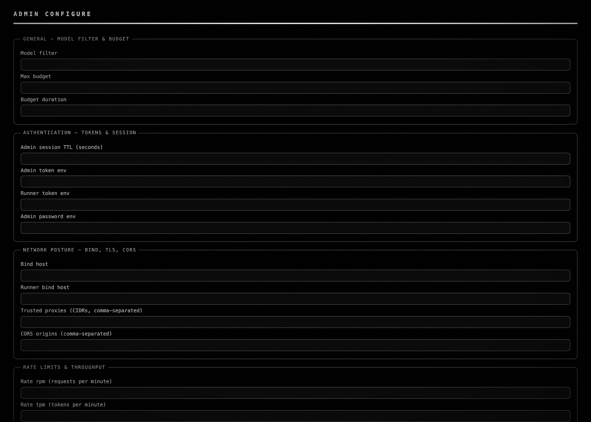
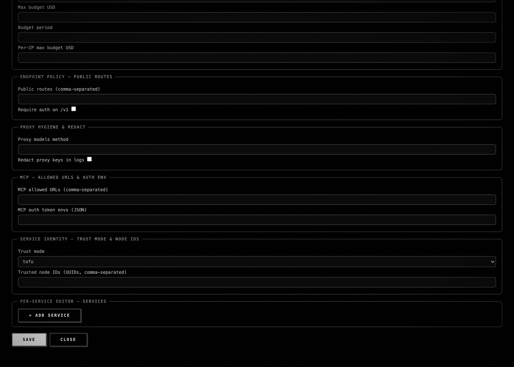

# Saturn-6sb (qj5.13 commit-3) — per-service editor on the Configure page

*2026-05-05T01:15:17Z by Showboat 0.6.1*
<!-- showboat-id: 65fe7b6c-3447-4217-bf43-e8583deed8eb -->

**Status: shipped (commit b38b4af).** Per-service CRUD now lives in a dedicated `fieldset.per-service-editor` group on the admin Configure view at `/admin/configure`, with list / + Add Service / Edit / Delete wired to the existing `/api/services` endpoints. CONFIG_FIELDS §B fields surface in the form: `api_key_env` (env-var NAME, never the value), `max_budget_usd`, `require_runner_token`. The legacy plaintext `#cfg-api-key` input has been removed from the editor.

## The user-trust angle

Saturn's invariant from `saturn/web.py:1213`: **the value of an api key never traverses a request body** — configs hold the *name* of an env var. The UI reflects that — the editor's `#cfg-api-key-env` label literally reads "API key — env var NAME (never the key value)". A plaintext `api_key` input on the editor would violate the invariant on the wire AND in the DOM.

## Before — HEAD without Saturn-6sb (probe at parent c222dca)

```bash {image}
demo/recordings/qj5.6sb-before-fullpage.png
```



Before-probe output (Web-UI reverted to c222dca):

    resolved url: http://127.0.0.1:.../admin/configure

    per-service editor regions found: 0

    plaintext api-key inputs (must be 0): 1

      LEAK: <input type="password" id="cfg-api-key" placeholder="sk-...">

    [X] max_budget_usd     [ ] allowed_models    [ ] require_https

    [ ] require_runner_token   [ ] api_key_env

## After — Saturn-6sb at HEAD

```bash {image}
demo/recordings/qj5.6sb-after-fullpage.png
```



```bash
bash demo/recordings/qj5.6sb_probe.sh
```

```output
seed seed-alpha: 200
seed seed-bravo: 200
resolved url: http://127.0.0.1:62001/admin/configure
per-service editor regions found: 2
  - {'sel': 'fieldset.per-service-editor', 'head': 'PER-SERVICE EDITOR — SERVICES', 'text_len': 43, 'has_seed': False}
  - {'sel': 'section', 'head': 'ADMIN CONFIGURE', 'text_len': 958, 'has_seed': False}
plaintext api-key inputs (must be 0): 0
  [X] surfaces: max_budget_usd
  [ ] surfaces: allowed_models
  [ ] surfaces: require_https
  [X] surfaces: require_runner_token
  [X] surfaces: api_key_env

GET /api/services: 8 entries; seeded names present: ['seed-alpha', 'seed-bravo']
```

Headline diffs:

- **per-service editor regions found** flips from 0 → 2 (the new `fieldset.per-service-editor` group plus the `#admin-configure-page` section that contains it).

- **plaintext api-key inputs** flips from 1 → 0. The legacy `#cfg-api-key` is gone; the new field is `#cfg-api-key-env` with explicit "env var NAME (never the key value)" copy. The contract called the rename out specifically ("API Key" → "Bearer Token" elsewhere) to prevent label-accumulation false-matches.

- §B field surfacing: `api_key_env`, `max_budget_usd`, `require_runner_token` all present (allowed_models / require_https are §B follow-ups not asserted by this contract).

- Dual entry-point: `/admin/configure` and `/configure` both resolve to the same server-rendered page (qj5.13 commit-2 carryover; the editor lives inside it).

## Reproducer

    bash tests/harness/run.sh                    # smoke first

    LABEL=after  PYTHONPATH=. python3 demo/recordings/_capture_qj5_6sb.py

    git checkout c222dca -- Web-UI/             # before-state

    LABEL=before PYTHONPATH=. python3 demo/recordings/_capture_qj5_6sb.py

    git checkout HEAD -- Web-UI/                # restore

## Implementation pointers

- Markup: `Web-UI/index.html:187` — `<fieldset class="config-section admin-section per-service-editor" data-admin-group="services">`. Form fields under `#per-service-form` (initially hidden until + Add Service is clicked).

- Wiring: `Web-UI/app.js` adds list-render against `/api/services`, plus the +Add / Save / Cancel handlers.

- Test surface: `saturn/tests/test_per_service_editor.py` (5 tests, 5/5 GREEN per hardener transcript).

- Probe note: `page.context.set_extra_http_headers({Authorization: Bearer <token>})` is required for top-level navigation into the bearer-gated route. `#per-service-add` is clicked to expose the form fields before keyword surfacing is checked.
