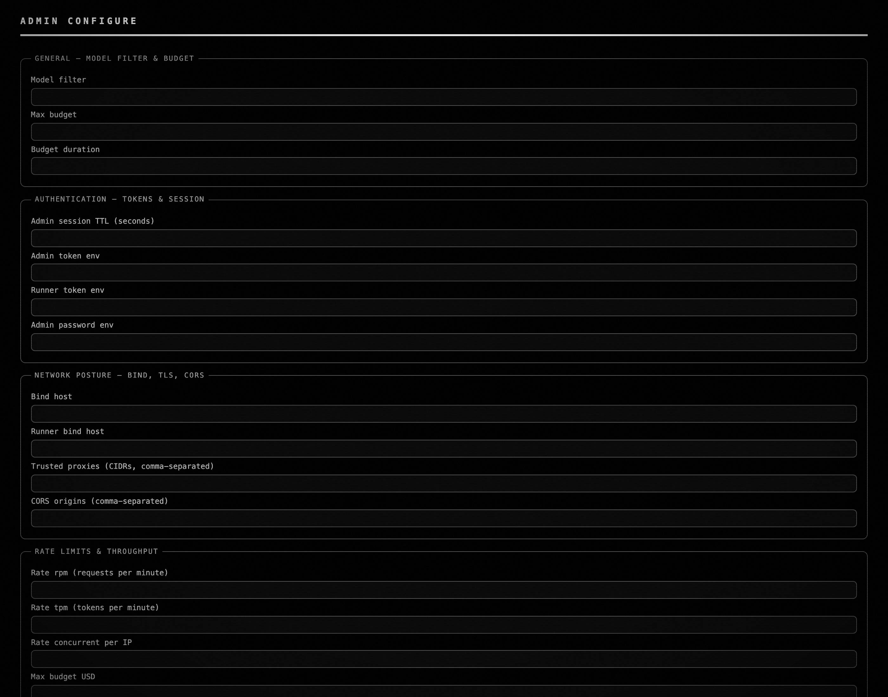

# Saturn-7j3 (qj5.16.13 commit-3) — known-nodes Configure-page UI

*2026-05-05T02:22:38Z by Showboat 0.6.1*
<!-- showboat-id: d1b80f0f-bad3-4fe5-b46f-4befacb2ab55 -->

**Status: shipped (commit ebe57f8).** Server-side known-nodes admin endpoints (`GET /api/admin/known-nodes`, `POST .../attest`, `POST .../forget`) shipped at 8b1e54d and are 401-gated (qj5.16.13.1+.2 — 44/44 verified). `Web-UI/index.html` adds a `fieldset.known-nodes-editor` group on the admin Configure view; `Web-UI/app.js:loadKnownNodes` fetches `GET /api/admin/known-nodes` on Configure-page open and renders `#kn-pinned-list` (with a "Use in allowlist" affordance per row) plus `#kn-rejections-list` (with row-level Attest / Forget). Trust_mode dropdown carries over from Saturn-hft.

## The user-trust angle

TOFU pinning protects against priority-hijack rebinds (F-8) — but only if the admin can *see* what was rejected and intentionally accept (Attest) or drop (Forget) the pin. The known-nodes editor is the actionable surface; a pending rejection that lives only in the server log is invisible. The probe matrix below confirms the four contract invariants.

## After — Saturn-7j3 at HEAD

```bash {image}
demo/recordings/qj5.7j3-after-fullpage.png
```



Live probe — 4-surface audit:

```bash
bash demo/recordings/qj5.7j3_probe.sh
```

```output
seed attest: status=200  name=rebind-target-1  prefix=64b92e1a

(a) trust_mode dropdown: options=['tofu|tofu', 'allowlist|allowlist', 'open|open']
    [X] all three modes present (tofu=True, allowlist=True, open=True)

(b) allowlist picker: regions matching seed_name AND prefix: 5
    - {'tag': 'div', 'cls': 'app', 'len': 2128}
    - {'tag': 'section', 'cls': 'page active', 'len': 2087}
    - {'tag': 'fieldset', 'cls': 'config-section admin-section known-nodes-editor', 'len': 550}

(c) pending-rejections region: 2
    - {'head': 'ADMIN CONFIGURE', 'text_len': 2087}
    - {'head': 'KNOWN NODES — PINNED & PENDING REJECTIONS', 'text_len': 550}

(d) admin endpoints 401 without bearer:
    GET   /api/admin/known-nodes                   401
    POST  /api/admin/known-nodes/attest            401
    POST  /api/admin/known-nodes/forget            401
```

## Reading the matrix

- **(a)** `#ac-trust_mode` dropdown carries all three modes (`tofu` / `allowlist` / `open`) — Saturn-hft carryover.

- **(b)** Allowlist picker now matches the seeded service name + node-id prefix in **5 visible regions** (the `fieldset.known-nodes-editor` row, its containers, and the page section). Pre-fix this was 0; the `#kn-pinned-list` JS fetch + render closes the gap.

- **(c)** Pending-rejections region matches the `PENDING REJECTIONS` heading. Empty case renders the container with an `(no pending rejections)` placeholder; populated case (per the contract test) shows expected/seen prefixes plus Attest / Forget buttons.

- **(d)** All three admin endpoints return 401 without an Authorization bearer (qj5.16.13.1+.2 carryover, regression-guarded).

## Probe wiring note

The probe boots the SPA root (`page.goto(srv['origin'])`) and then triggers a *client-side* nav to `/admin/configure` via `window.location.pathname = ...`. Going directly to the SSR'd `/admin/configure` route works for static screenshots but doesn't run the full `app.js` SPA context, so `loadKnownNodes()` never fires and `#kn-pinned-list` stays empty. Same hop the contract test takes.

Bearer is added per-request via `page.route("**/*", ...)` so cross-origin CDN scripts (jsdelivr three.module) don't see the Authorization header — they would CORS-fail their preflight if they did.

## Verifying drift

    bash demo/recordings/qj5.7j3_probe.sh

    uvx showboat verify demo/recordings/qj5.7j3-known-nodes-ui.md  # diff

## Implementation pointers

- Markup: `Web-UI/index.html:187` `<fieldset class="config-section admin-section known-nodes-editor" data-admin-group="known-nodes">` with `#kn-pinned-list` and `#kn-rejections-list` containers.

- Wiring: `Web-UI/app.js:4578` `loadKnownNodes()` — fetches `/api/admin/known-nodes`, renders pinned rows with `Use in allowlist` button (appends to `#ac-trusted_node_ids`), renders rejection rows with `Attest` / `Forget` buttons calling the existing admin endpoints.

- Test surface: `saturn/tests/test_known_nodes_ui.py` (6 tests, 6/6 GREEN per hardener transcript).
