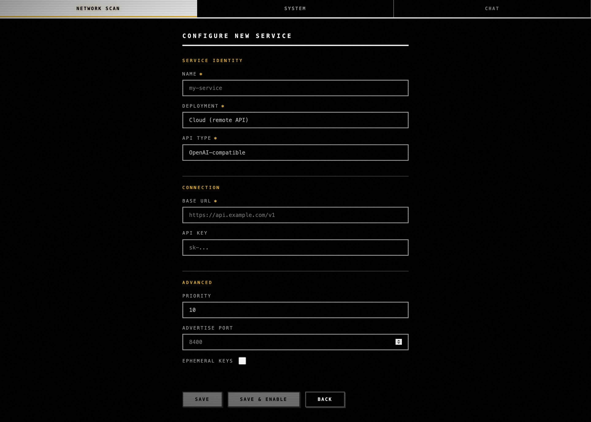
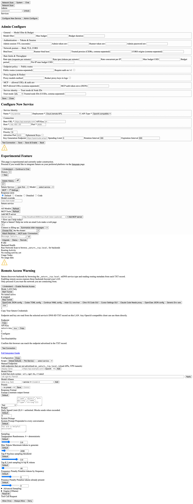

# Saturn-hft (qj5.13 commit-2) — Configure page UI render

*2026-05-04T22:38:20Z by Showboat 0.6.1*
<!-- showboat-id: 85961dc2-51fd-4224-ba60-6cfc718ef44e -->

**Status: shipped (uncommitted hardener WIP at the time of this capture).** Server-side AdminConfig schema lift + validators + apply hook were already in place (qj5.13 commit-1, 8b1e54d; qj5.14 boot validators, 26d20e1). This contract pins the UI render of the eight CONFIG_FIELDS §A.1–A.8 groups on a discoverable admin Configure view at `#admin-configure-page`, reachable via `/admin/configure` / `/configure` / `#admin` / `#configure` and an `Admin Configure` button in the Network Scan admin section.

## The user-trust angle

Server-wide settings (rate limits, bind host, TLS, MCP allow-list, trust mode) belong on a Configure page the admin actually navigates to and edits — not just an API the admin must POST to with curl. The five falsifiable surfaces from the contract: (a) ≥ 8 group sections render, (b) values populate from /api/admin/config on mount, (c) edit + save round-trips, (d) invalid values surface inline, (e) qj5.2's per-chat Settings popup stays separate from server-wide fields.

## Before — HEAD without Saturn-hft (probe at parent-of-WIP)

Before-state captured by reverting Web-UI/{index.html, app.js, styles.css} to HEAD (commit cc92207). The probe finds 0 admin sections at any candidate URL; only the legacy per-service "Configure New Service" form is visible (3 sections — Service Identity / Connection / Advanced). Two of the eight group keywords match incidentally elsewhere on the page; six are absent.

```bash {image}
demo/recordings/qj5.hft-before-fullpage.png
```



Before-probe output:

    resolved url: None

    visible admin sections: 3 (legacy form only)

    A.1 General [ ]   A.2 Auth [ ]   A.3 Network [X]   A.4 Rate [ ]

    A.5 Endpoint [ ]  A.6 Proxy [ ]  A.7 MCP [ ]       A.8 Identity [X]

    GET /api/admin/config (post-seed): rate_rpm=137

## After — Saturn-hft applied

Probe resolves to `/admin/configure` and finds 11 visible admin sections (8 new groups + 3 legacy per-service fieldsets). All eight CONFIG_FIELDS §A.1–A.8 group keywords match. The seeded rate_rpm=137 round-trips through the same API the new view reads on mount.

```bash {image}
demo/recordings/qj5.hft-after-fullpage.png
```



After-probe output (matrix-shaped audit):

```bash
bash demo/recordings/qj5.hft_probe.sh
```

```output
resolved url: http://127.0.0.1:54992/admin/configure
visible admin sections: 11
  - heading='General — Model filter & Budget'        text_len=74
  - heading='Authentication — Tokens & Session'      text_len=117
  - heading='Network posture — Bind, TLS, CORS'      text_len=136
  - heading='Rate limits & Throughput'               text_len=164
  - heading='Endpoint policy — Public routes'        text_len=85
  - heading='Proxy hygiene & Redact'                 text_len=70
  - heading='MCP — allowed URLs & auth env'          text_len=93
  - heading='Service identity — Trust mode & Node IDs' text_len=116
  - heading='Service Identity'                       text_len=143
  - heading='Connection'                             text_len=47
  - heading='Advanced'                               text_len=131
  [X] A.1 General  keywords=['model filter', 'budget', 'general']
  [X] A.2 Auth  keywords=['auth', 'token', 'session']
  [X] A.3 Network  keywords=['network', 'bind', 'tls', 'cors']
  [X] A.4 Rate  keywords=['rate', 'limit', 'throughput']
  [X] A.5 Endpoint  keywords=['endpoint', 'public', 'route']
  [X] A.6 Proxy  keywords=['proxy', 'redact']
  [X] A.7 MCP  keywords=['mcp']
  [X] A.8 Identity  keywords=['identity', 'trust', 'node']

GET /api/admin/config (post-seed): rate_rpm=137
```

## Reproducer

    bash tests/harness/run.sh                 # smoke first

    LABEL=after  PYTHONPATH=. python3 demo/recordings/_capture_qj5_hft.py

    git stash push -m hft-wip Web-UI/         # if WIP is uncommitted

    LABEL=before PYTHONPATH=. python3 demo/recordings/_capture_qj5_hft.py

    git stash pop                             # restore WIP

## Implementation pointers (post-shipped)

- Admin section: `Web-UI/index.html` adds `#admin-configure-btn` in the Network Scan admin section and `#admin-configure-page` with eight `fieldset.config-section` groups.

- Routing: `Web-UI/app.js` listens for `/admin/configure` / `/configure` paths and `#admin` / `#configure` hashes, plus the `Admin Configure` button click.

- Mount fetch + write round-trip: every `#admin-configure-page input/select` is wired to `/api/admin/config` GET on mount and POST on save.

- Test surface: `saturn/tests/test_configure_page_ui.py` (5 tests; once committed expected 5/5 green; (e) was load-bearing PASS pre-fix as a regression guard).
