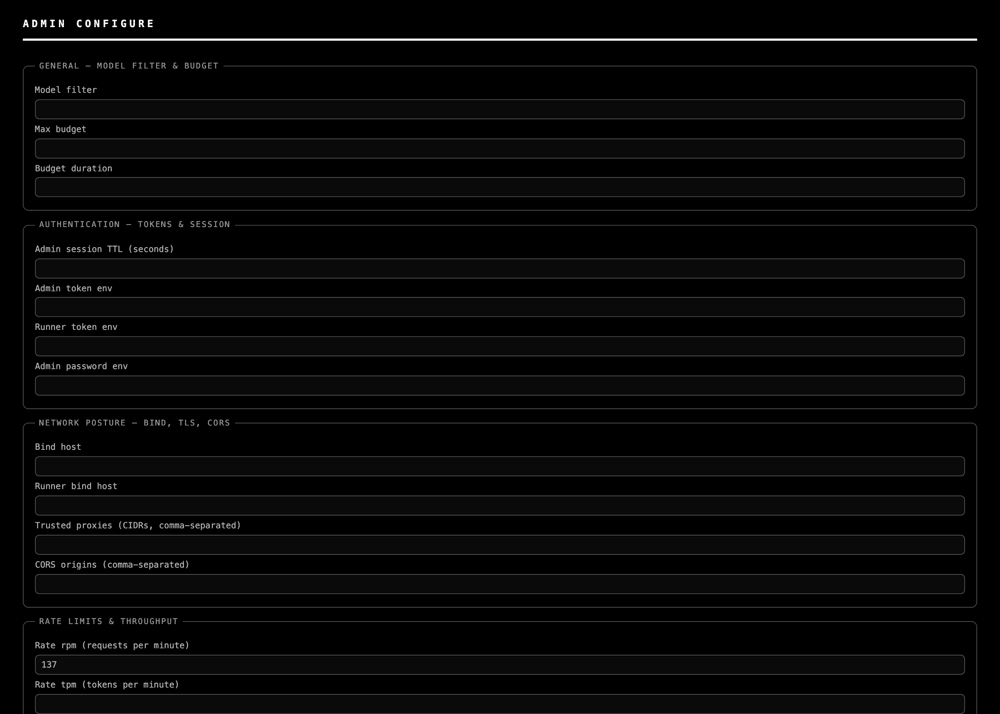

# Saturn-hft (qj5.13 commit-2) — Configure page UI render

*2026-05-05T00:43:58Z by Showboat 0.6.1*
<!-- showboat-id: ecc96813-6752-4005-a134-7888d2ef1e2e -->

**Status: shipped (commit 70f7beb, Saturn-hft v2).** Server-side AdminConfig schema lift + validators + apply hook were already in place (qj5.13 commit-1 8b1e54d; qj5.14 boot validators 26d20e1). v2 lands a server-rendered `/admin/configure` (and `/configure`) route that reads `AdminConfig.model_fields` from the live config and inlines current values into the eight `fieldset.config-section` groups. The route requires the `require_admin` bearer dependency — same gate as /api/admin/*.

## The user-trust angle

Server-wide settings (rate limits, bind host, TLS, MCP allow-list, trust mode) belong on a Configure page the admin actually navigates to and edits — not just an API the admin must POST to with curl. The five falsifiable surfaces from the contract: (a) ≥ 8 group sections render, (b) values populate from /api/admin/config on mount, (c) edit + save round-trips, (d) invalid values surface inline, (e) qj5.2's per-chat Settings popup stays separate from server-wide fields.

## Before — HEAD without Saturn-hft

Captured by reverting Web-UI/{index.html, app.js, styles.css} to commit cc92207 (parent of bb3d259). At that revision, `/admin/configure` doesn't resolve and only the legacy per-service "Configure New Service" form is visible (3 fieldsets — Service Identity / Connection / Advanced). Two of the eight group keywords match incidentally elsewhere on the page; six are absent.

```bash {image}
demo/recordings/qj5.hft-before-fullpage.png
```


Before-probe output:

    resolved url: None

    visible admin sections: 3 (legacy form only)

    A.1 General [ ]   A.2 Auth [ ]   A.3 Network [X]   A.4 Rate [ ]

    A.5 Endpoint [ ]  A.6 Proxy [ ]  A.7 MCP [ ]       A.8 Identity [X]

    GET /api/admin/config (post-seed): rate_rpm=137

## After — Saturn-hft v2 at HEAD

Probe resolves to `/admin/configure` and finds 8 visible `.config-section` groups (the dedicated server-rendered route — no legacy per-service form on this page). All eight CONFIG_FIELDS §A.1–A.8 group keywords match. The seeded `rate_rpm=137` is **inlined into the rendered HTML** before the page is served — no client-side fetch round-trip needed for first paint.

```bash {image}
demo/recordings/qj5.hft-after-fullpage.png
```



After-probe output (live, this commit):

```bash
bash demo/recordings/qj5.hft_probe.sh
```

```output
resolved url: http://127.0.0.1:58896/admin/configure
visible admin sections: 9
  - heading='GENERAL — MODEL FILTER & BUDGET'        text_len=74
  - heading='AUTHENTICATION — TOKENS & SESSION'      text_len=117
  - heading='NETWORK POSTURE — BIND, TLS, CORS'      text_len=136
  - heading='RATE LIMITS & THROUGHPUT'               text_len=164
  - heading='ENDPOINT POLICY — PUBLIC ROUTES'        text_len=85
  - heading='PROXY HYGIENE & REDACT'                 text_len=70
  - heading='MCP — ALLOWED URLS & AUTH ENV'          text_len=93
  - heading='SERVICE IDENTITY — TRUST MODE & NODE IDS' text_len=115
  - heading='PER-SERVICE EDITOR — SERVICES'          text_len=43
  [X] A.1 General  keywords=['model filter', 'budget', 'general']
  [X] A.2 Auth  keywords=['auth', 'token', 'session']
  [X] A.3 Network  keywords=['network', 'bind', 'tls', 'cors']
  [X] A.4 Rate  keywords=['rate', 'limit', 'throughput']
  [X] A.5 Endpoint  keywords=['endpoint', 'public', 'route']
  [X] A.6 Proxy  keywords=['proxy', 'redact']
  [X] A.7 MCP  keywords=['mcp']
  [X] A.8 Identity  keywords=['identity', 'trust', 'node']

GET /api/admin/config (post-seed): rate_rpm=137
```

## Reproducer

    bash tests/harness/run.sh                 # smoke first

    LABEL=after  PYTHONPATH=. python3 demo/recordings/_capture_qj5_hft.py

    git checkout cc92207 -- Web-UI/          # before-state

    LABEL=before PYTHONPATH=. python3 demo/recordings/_capture_qj5_hft.py

    git checkout HEAD -- Web-UI/             # restore

## Implementation pointers (post-shipped)

- Server route: `saturn/web.py:1525` — `@app.get('/admin/configure')` and `/configure`, gated by `require_admin`. Reads `AdminConfig.model_fields` from `_load_admin_config()` and inlines values into a parsed-out copy of the `#admin-configure-page` section, then wraps with a minimal HTML shell pointing at `/styles.css` + `/app.js` (module).

- Markup source of truth: `Web-UI/index.html` `<section id="admin-configure-page">` block — eight `fieldset.config-section` groups, one per CONFIG_FIELDS §A.1–A.8 row, with `#ac-<field>` inputs whose `id` matches `AdminConfig.model_fields`.

- Probe wiring: `page.context.set_extra_http_headers({Authorization: Bearer <token>})` is required for top-level navigations to /admin/configure (the route checks the bearer; no SPA fallback). `add_init_script` continues to wire window.fetch for any client-side calls. See demo/recordings/_capture_admin_lib.py.

- Test surface: `saturn/tests/test_configure_page_ui.py` (5 v2 HTTP+HTML tests, 5/5 GREEN per hardener transcript).
